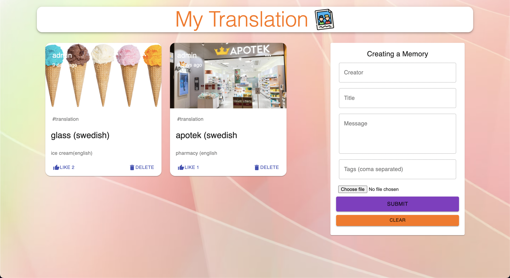

# mytranslation

Here is the [Translation card app](https://mytranslation-app.netlify.app/) on Netlify, Enjoy!

# Technologies
Full Stack MERN Application:
- React
- Redux
- Node
- Express
- Javascript
- HTML5
- CSS3
- MaterialUI
- MongoDB

## Deployment
### Deploy

- Select the repository on GitHub for this project where all the code is stored.
- Then click the Settings link at the top with the cogwheel icon next to it.
- Scroll down till reaching the GitHub Pages Heading.
- Locate the source section and click on the branch master then select the master branch.
- This will then publish the project to GitHub Pages and display the URL of the live website. (may have to refresh and scroll back to this 
section to see the URL)
- The deployed website version will be tracked to your last commit so if you have made changes without committing and pushing them to GitHub 
those changes will not be live.
